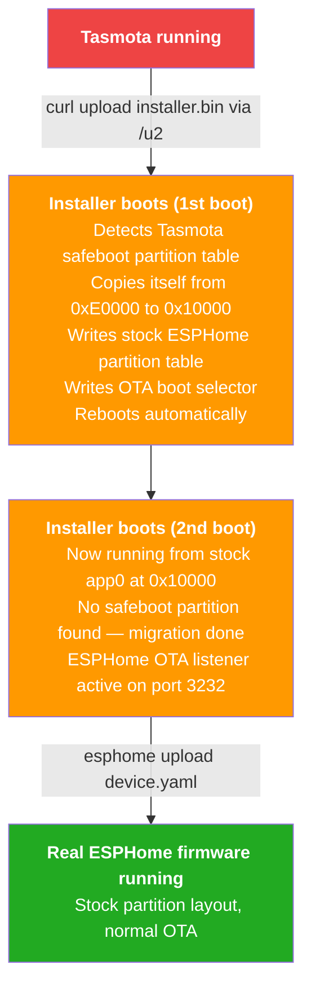
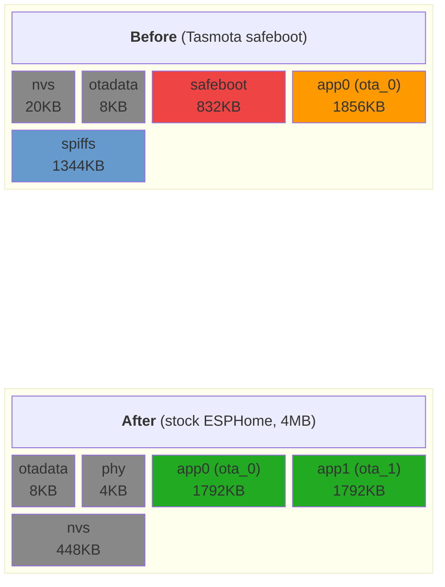

# tasmota-migrate

Migrate ESP32 devices from [Tasmota](https://github.com/arendst/Tasmota) (safeboot layout) to [ESPHome](https://github.com/esphome/esphome) over the air -- no serial cable required.

An ESPHome "installer" firmware is uploaded via Tasmota's built-in HTTP update endpoint. It automatically repartitions the flash to match stock ESPHome, then accepts the real ESPHome firmware via the standard `esphome upload` command.

After migration, the device has the **exact same partition layout** as a freshly flashed ESPHome device. No custom partition tables needed.

## Prerequisites

- ESP32 device running Tasmota with the **safeboot** partition layout
- Device accessible on the network
- ESPHome CLI installed (`pip install esphome`)

## Quick Start

### 1. Create the installer config

Copy `installer.example.yaml` and fill in your WiFi credentials:

```yaml
# installer.yaml
esphome:
  name: tasmota-migrator

esp32:
  board: esp32dev  # change to match your device
  framework:
    type: esp-idf

wifi:
  ssid: "YourNetwork"
  password: "YourPassword"

  ap:
    ssid: "Tasmota-Migrate"

logger:

ota:
  - platform: esphome

external_components:
  - source:
      type: local
      path: components

tasmota_migrate:
```

### 2. Build the installer

```bash
esphome compile installer.yaml
```

### 3. Upload to the Tasmota device

Via curl:

```bash
FIRMWARE=.esphome/build/tasmota-migrator/.pioenvs/tasmota-migrator/firmware.bin
curl -F "file=@${FIRMWARE};filename=firmware.bin" \
     "http://<TASMOTA_IP>/u2?fsz=$(stat -c%s ${FIRMWARE})"
```

Or via the Tasmota web UI: **Firmware Upgrade** > **Upload**.

The device reboots twice automatically (~15 seconds). No action required.

### 4. Upload the real ESPHome firmware

Use a completely standard ESPHome config -- no special partition table needed:

```yaml
esp32:
  board: esp32dev
  framework:
    type: esp-idf
```

Then upload:

```bash
esphome upload device.yaml --device <DEVICE_IP>
```

Done. The device is now running ESPHome with full dual-OTA support, identical to a fresh serial flash.

## How It Works



The installer copies itself to the stock ESPHome `app0` location before rewriting the partition table. This is safe because the copy destination (`0x10000`) does not overlap with the running installer (`0xE0000`). ESP-IDF app images are flash-position-independent, so the copied firmware boots correctly from its new address.

### Partition Layout



App partition sizes scale automatically with flash size:

| Flash | App partition size |
|-------|--------------------|
| 4MB | 1792KB |
| 8MB | 3840KB |
| 16MB | 7936KB |

These are the same sizes ESPHome generates for a stock ESP-IDF build.

## Limitations

- **ESP32 only** (all variants: ESP32, S2, S3, C3, C6, H2).
- **Tasmota safeboot layout required**. The component detects the layout by scanning for a factory partition named `safeboot`. Other layouts are ignored (component becomes a no-op).
- **Minimum 4MB flash**.
- **No recovery partition after migration**. If the ESPHome firmware is corrupt, serial flashing is needed. This is the same as a standard ESPHome installation.
- **NVS is reset**. Tasmota settings are not carried over.

## Project Structure

```
tasmota-migrate/
  components/
    tasmota_migrate/
      __init__.py              # ESPHome component registration
      tasmota_migrate.h        # C++ header
      tasmota_migrate.cpp      # Migration implementation
  installer.example.yaml       # Installer firmware config
  device.example.yaml          # Real device config example
```

## Technical Details

### Migration Steps

1. **Detect**: read partition table at `0x8000`, scan for factory partition labeled `safeboot`.
2. **Measure**: parse ESP-IDF image headers at `0xE0000` to determine firmware size.
3. **Copy**: sector-by-sector flash copy from `0xE0000` to `0x10000` (no overlap with running code).
4. **Repartition**: erase and write new partition table at `0x8000` matching stock ESPHome layout.
5. **Boot select**: write otadata at `0x9000` with `ota_seq=1` to boot `app0` at `0x10000`.
6. **Reboot**: bootloader reads the new partition table and boots the copied installer.

### Partition Table Format

The ESP32 partition table lives at flash offset `0x8000` (4KB). Each entry is 32 bytes:

```
Bytes 0-1:   Magic (0xAA50)
Byte  2:     Type (0=app, 1=data)
Byte  3:     SubType
Bytes 4-7:   Offset (little-endian)
Bytes 8-11:  Size (little-endian)
Bytes 12-27: Label (null-padded)
Bytes 28-31: Flags
```

Entries are followed by an MD5 trailer (magic `0xEBEB`, 14 bytes `0xFF` padding, 16 bytes MD5 hash of all entries). Remaining space is `0xFF`.

### OTA Data Format

Two 4KB sectors at `0x9000` store the boot selection. Each holds a 32-byte structure:

```
Bytes 0-3:   ota_seq (sequence number, little-endian)
Bytes 4-27:  Padding (0xFF)
Bytes 28-31: CRC32 of ota_seq (init=0xFFFFFFFF)
```

The bootloader selects: `(highest_valid_seq - 1) % num_ota_partitions`.

The installer writes `ota_seq=1` which selects `(1-1) % 2 = 0` -> `ota_0` at `0x10000`.

## License

MIT
